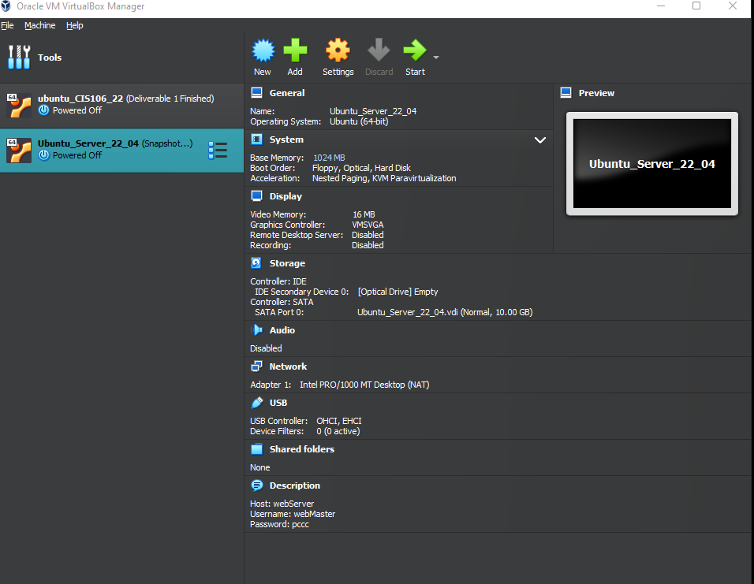
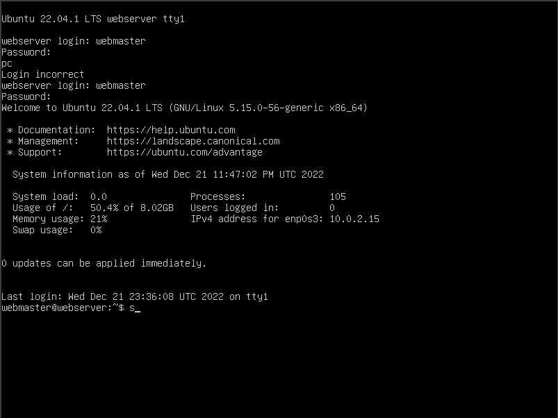
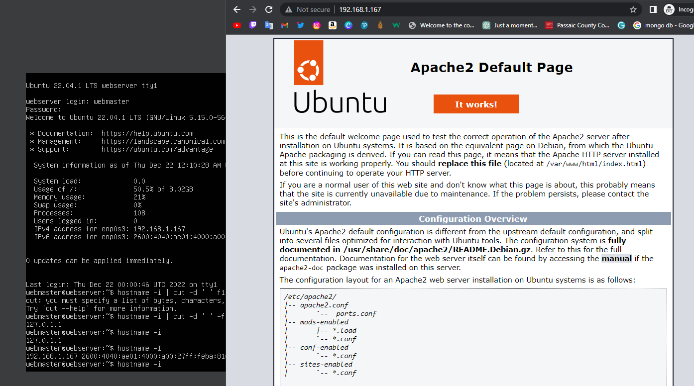
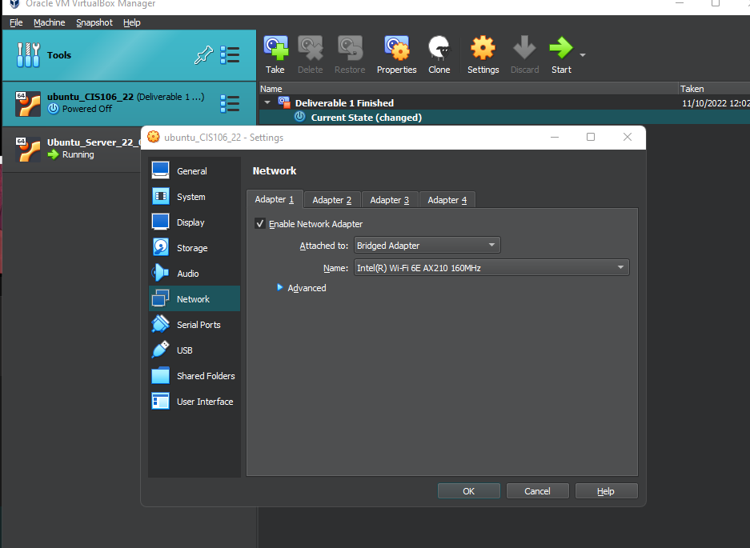
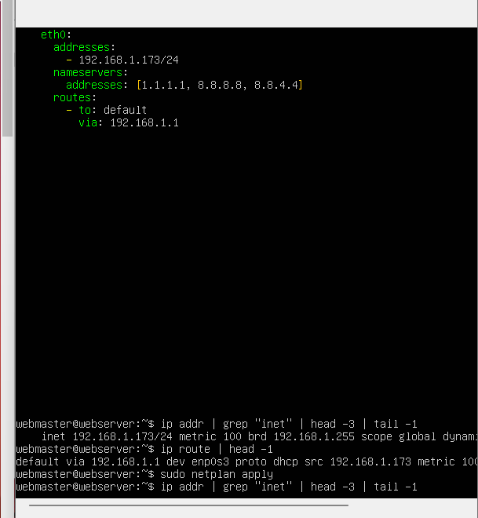
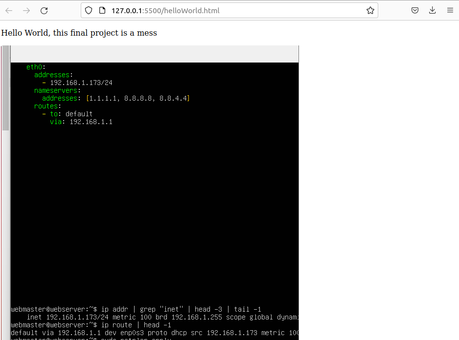

# Deliverable 1

# Concepts I don't understand:

- Web Server - A Web server can be hardware or software, or both of them working together
- UFW firewall - is a frontend for iptables that provides a framework for managing netfilter. 
- Systemd - is a system and service manager for Unix like operating systems

# Answer the following questions: 
**What is a web server? Hardware and software side**
*A Web server can be hardware or software, or both of them working together.*
  1. The hardware side is a computer that store web server software, and components (HTML, CSS, JavaScript).
  2. Software side is the software itself, which controls how web users access hosted files.
**What are some different web server applications?**
+ Apache Tomcat
+ Oracle WebLogic
+ Resin
+ IBM WebSphere
  
**What is virtualization?**
Virtualization is a modern technology that lets you simulate a virtual machine inside a physical machine. There are generally two types of virtualization; server-side virtualization, and client-side virtualization. 
**What is virtualbox?**
Virtualbox is a virtualization product that is consider a type 2 virtualization. Virtualbox is a open source under the GPL version 2.
**What is a virtual machine?**
A virtual machine is a computer system that is created based on another physical machine software.
**What is Ubuntu Server?**
Ubuntu server is a larger set of Ubuntu products, that differ from each other a little but from Ubuntu desktop.
**What is a firewall?**
Firewall is a network that provide protection against cyber attacks by shielding your computer or network
**What is SSH?**
SSH means Secure Shell or Secure Socket Shell, which is a network protocol that gives user a secure way to access a computer.

# Final Project

**Still give me problems after I checked all the numbers one by one and the spaces too**

**Here is the website**

