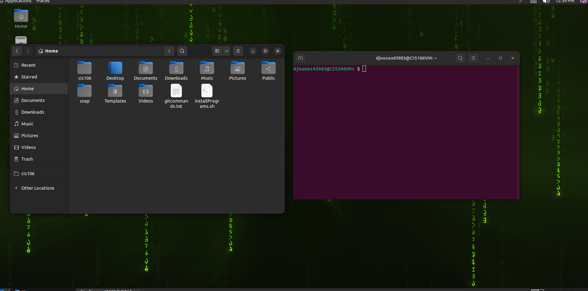

# Lab 3 Submission

## Question
Has no submission 

## Question 2

## Question 3

| Program purpose     | Package Name     | Version                      |
| ------------------- | ---------------- | ---------------------------- |
| Play a tetris game  | blockattack      | 2.7.0-1 amd64                |
| Play a video file   | dragonplayer     | 4:21.12.3-0ubuntu1 amd64     |
| Browse the internet | epiphany-browser | 42.4-0ubuntu1 amd64          |
| Read your email     | mgetty-voice     | 1.2.1-1.1 amd64              |
| Play music          | csound           | 1:6.17.0~dfsg-3ubuntu1 amd64 |

1. Which command did you use to install?
    The command that you use to install is "sudo apt install ___ -y"
2. Which command did you use to remove?
    The command that you use to remove is "sudo apt remove ___ -y"
3. Which command will you use to install and remove? 
    The command that you use to install and remove is "sudo apt install ___ - ____+ " 
## Question 4

| command | what it does                                                              |
| ------- | ------------------------------------------------------------------------- |
| echo    | display a line of text                                                    |
| fortune | fortune - print a random, hopefully interesting, adage                    |
| cowsay  | generates an ASCII picture of a cow saying something provided by the user |
| lolcat  | rainbow coloring effect for text console display                          |
| figlet  | rainbow coloring effect for text console display                          |
| toilet  | display large colorful characters                                         |
| rig     | display large colourful characters                                        |
