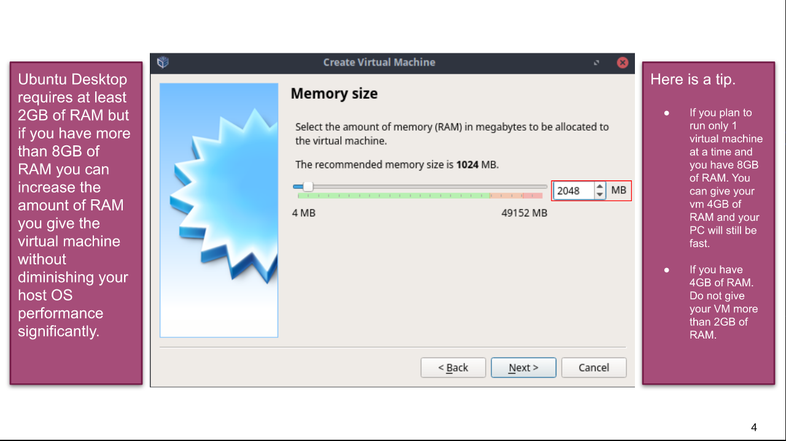
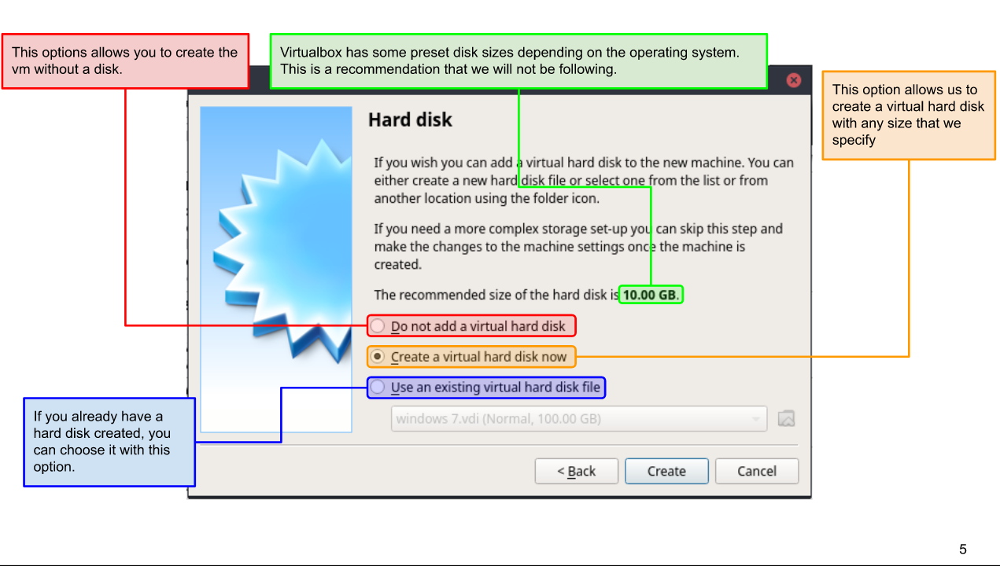
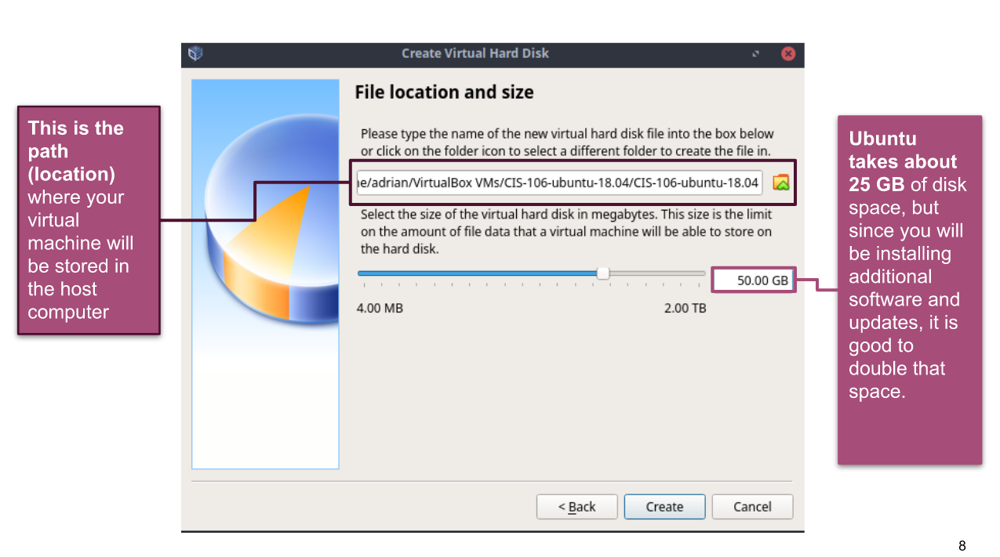
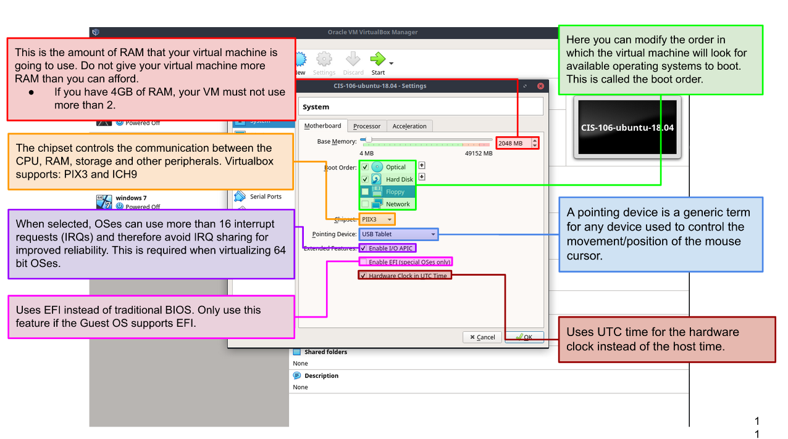
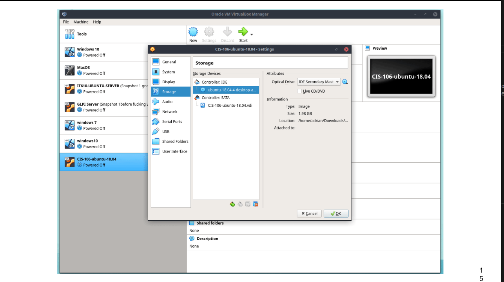

# Week Report 2

## Basics of virtualization

1. **What is virtualization**
   Virtualization is a tool used to simulate a virtual machine inside of a physical machine
2. **Types of virtualization**
   The two types of virtualization are server-side virtualization and client-side virtualization. Server-side provides a virtual desktop to each user and most processing is done on the server. However, in client-side each user has its own operating system installed and the processing is done on their computer 
## Installing ubuntu in Virtualbox
* Ubuntu Memory Size

* Ubuntu Virtual Disk

* Ubuntu Disk Space

* Ubuntu RAM

* Ubuntu Optical Drive

