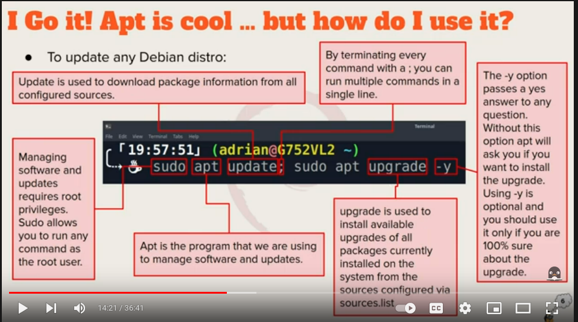

# Week Report 3

## *Summary of Presentations*

#### Exploring Desktop Environments
1. **Bulleted list of different desktop environments**
   + Cinnamon
   + MATE
   + Openbox
   + LXQT
   + GNOME
   + KDE
2. **Definitions for the following terms: GUI, DE**
   + GUI - stands for graphical user interface, which is a set of programs that let the user interact with the system via icons, windows, menus, panels, and other visual elements. 
   + DE - stands for desktop environment, which is an implementation of the desktop metaphor made of a bunch of programs running on the top of a computer OS.
3. **Bulleted list of the common elements of a desktop environment**
   + Desktop Settings
   + Display Manager
   + File Manager
   + Icons
   + Launcher
   + Panels
   + Menus
#### The Bash Shell
4. **What is a shell?**
   Shell is a free command line tool that provides access to the Linux system
5. **List different shells**
   + Tcsh Shell
   + Csh Shell
   + Ksh Shell
   + Zsh Shell
   + Fish Shell
6. **List some bash shortcuts** 
   + Ctrl + A
   + Ctrl + E
   + Ctrl + L
   + Ctrl + Q
   + Ctrl + R
   + Alt + U
   + Alt + I
7. **List basic commands and their usage**
   + !! - run last command
   + !blah - run the most recent command that starts with the words after !
   + !$ - the last word of the previous command
#### Managing Software
1. **Command for updating ubuntu**
   +  sudo apt update 
2. **Command for installing software**
   + sudo apt install ___ -y
3. **Command for removing software**
   + sudo apt remove ___ -y
4. **Command for searching for software**
   + apt search " "
5. **Definition of the following terms:**
    + **Package** - is a archive that contain binaries of software, configuration files, and information about dependencies needed to install a specific software (.exe files)
    + **Library** - is reusable code that can be use by different applications to complete a particular tasks
    + **Repository** - is a collection of software available for download
6. **Include the screenshot of how to update ubuntu with its explanation** 
   
