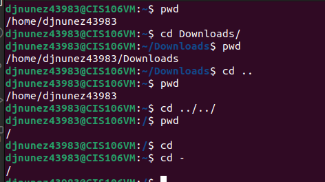
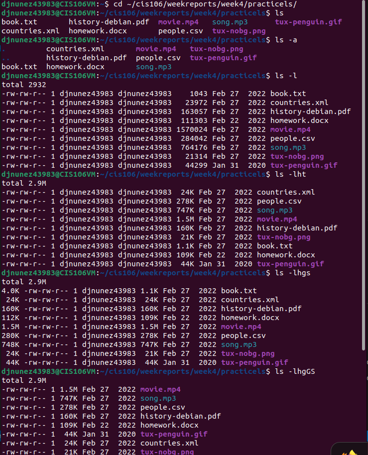
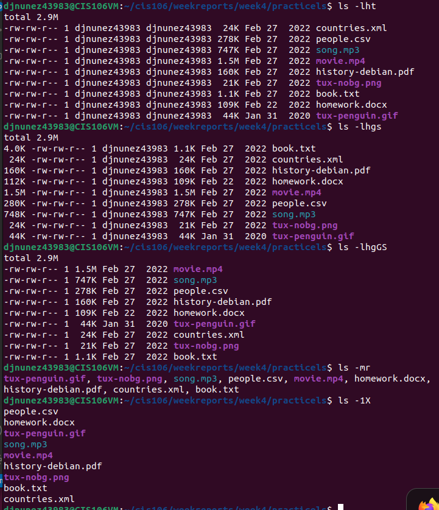

# Week Report 4

## Practice

## The Filesystem (some important Directories)

| Directory | Data Stored in Directory                                                                                                                     |
| --------- | -------------------------------------------------------------------------------------------------------------------------------------------- |
| bin       | Essential commands                                                                                                                           |
| dev       | Device files                                                                                                                                 |
| etc       | System configuration files                                                                                                                   |
| home      | User home directories                                                                                                                        |
| media     | Mount point for removable media, such as DVDs and floppy disks                                                                               |
| opt       | Add-on software packages                                                                                                                     |
| proc      | Kernel information, process control, system hardware information                                                                             |
| srv       | Information relating to services that run on the system                                                                                      |
| usr       | Software not essential for system operation, such as applications                                                                            |
| var       | Dedicated to variable data, such as logs,databases, websites, and temporary spool (e-mail,etc.) files that persist from one boot to the next |

## Commands to navigate the filesystem 

| command | What it does                                               | Syntax | Example          |
| ------- | ---------------------------------------------------------- | ------ | ---------------- |
| pwd     | prints current working directory                           | 'pwd'  | 'pwd'            |
| cd      | used for changing the current working directory            | 'cd'   | 'cd ~/Downloads' |
| ls      | used for displaying all the files inside a given directory | 'ls'   | 'ls ~/Downloads' |

## Key Terms

*Definition of the following terms*

+ **File system** - The way files are stored and organized to simplify access to data
+ **Current directory** - is where you are at the moment
+ **Parent directory** - is where you are working and you can move back and forward to subdirectories
+ **The difference between your home directory and the home directory** - My home directory is where all my files are located and the home directory is where you will find other home directories.
+ **Pathname** - The location of the file in the filesystem (like an address).
+ **Relative path** - The location of a file starting from the current working directory or a directory that is located inside the current working directory.
+ **Absolute path** - The location of a file starting at the root of the file system