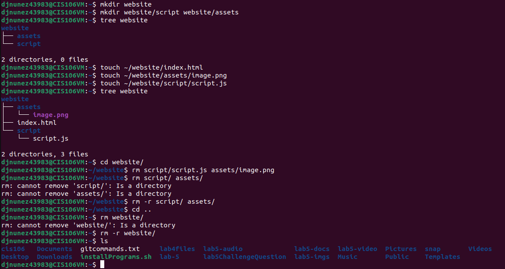
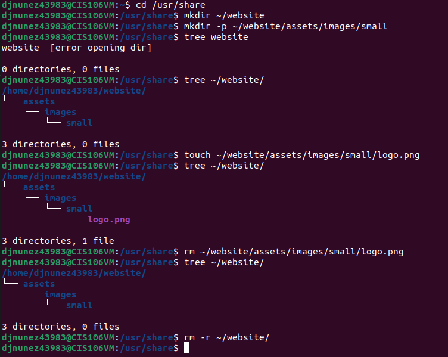
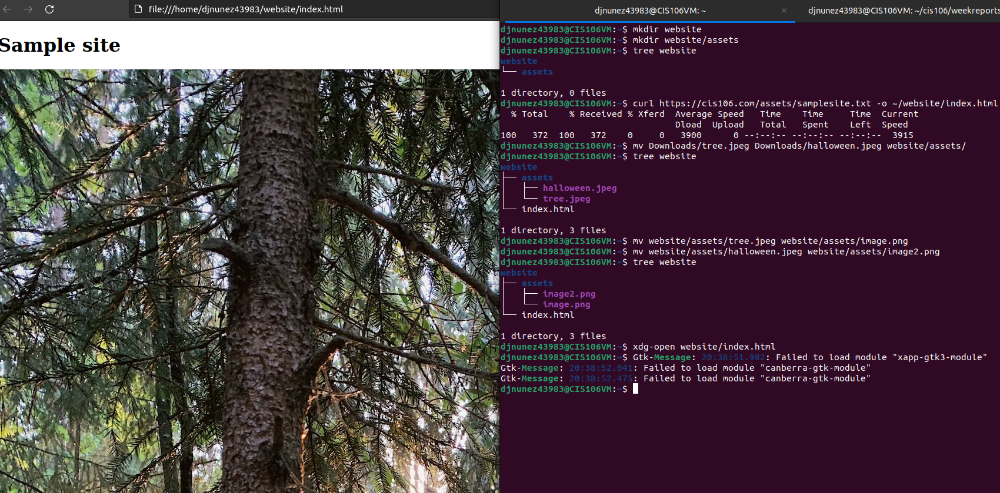
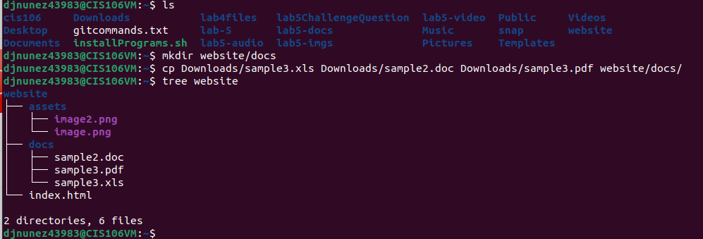

# Week Report 5

## What are Command Options?
Command Options allow you to modify/enhance behavior

## What are Command Arguments?
Command Arguments are items open which the command acts on

## Which command is used for creating directories? Provide at least 3 examples.
The command for creating directories is mkdir. **_(mkdir + name of directory)_**

**Examples**
+ mkdir wallpapers (create a dir in the present dir)
+ mkdir -p wallpapersOthers/movies (create dir with a parent dir at the same time)
+ mkdir wallpapers/cars wallpapers/cities wallpapers/forest (creating multiple dir)
  
## What does the touch command do? Provide at least 3 examples.
The command touch creates a file. 

**Examples**
+ touch listOfCars.txt script.py (create several files)
+ touch ~/Downloads/games.txt (create a file using absolute path)
+ touch Downloads/games2.txt (creating a file using relative path)
+ touch "list of foods.txt" (creating a file with a space in its name)

## How do you remove a file? Provide an example.
To remove a file you use the rm command (rm file)
## How do you remove a directory and can you remove non-empty directories in Linux? Provide an example
To remove a file you use the command rm combined with -r (rm -r). You are not able to remove non-empty directories unless you use recursion (-r) 

**Examples**
+ rm -r Downloads/games (remove an non-empty directory)
## Explain the mv and cp command. Provide at least 2 examples of each
**mv Command:** 
Allow users to move and rename directories 
+ mv Downloads/homework.pdf Documents/    
+ mv homework.pdf homework5.pdf

**cp Command:**
Allow users to copy files/directories from a source to a destination **_(cp + file to copy + destination)_** 
+ cp Downloads/wallpapers.zip Pictures/ (copy a file)
+ cp -r ~/Downloads/wallpapers ~/Pictures/ (copy a directory with absolute path)

## Practice 

+ _**Practice 1**_

+ _**Practice 2**_

+ _**Practice 3**_

+ _**Practice 4**_
