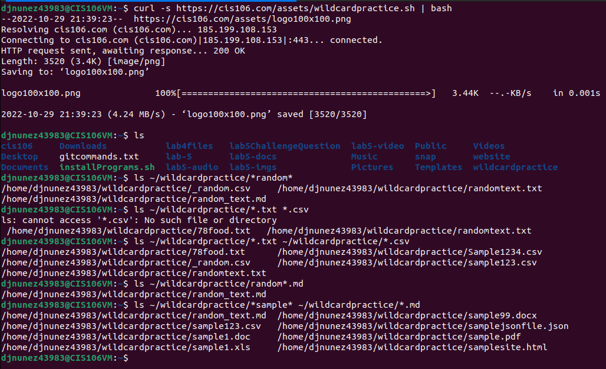
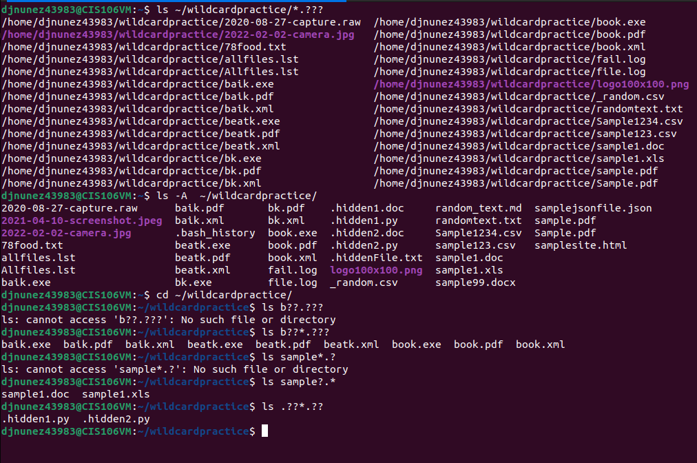
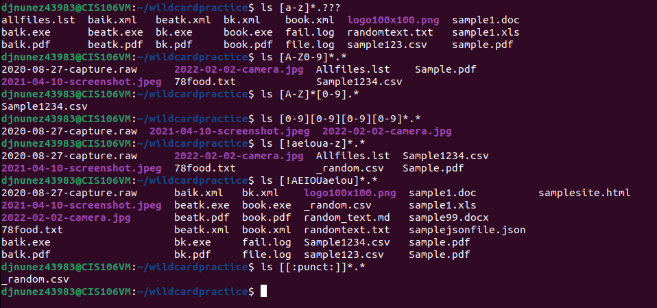

# Week Report 6

## Wildcards 
**At least 3 examples per wildcard (*,?,[])**

**The * Wildcard**
Matches anything and nothing (any number of characters)
+ ls *.pdf **(display files with the .pdf extension)**
+ ls file.* **(display files regardless of the file extension)**
+ ls *.txt *.pdf **(display files with the file extension .txt and .pdf)**

**The ? Wildcard**
Matches one character at a time
+ ls b??l* **(list all the files with two characters between b and k)**
+ ls *.??? **(list a file with 3 characters of file types and any name)**
+ ls ./.??* **(list all hidden files in the pwd)**

**The [] Wildcard**
Matches a single character in a given range
+ ls f[!aeiou]*  **(files that don't have a vowel after the letter f)**
+ ls *[0-9]* **(files that have at least one number)**
+ ls [a-fp-z]*  **(files that have the two sets of character: letters from a-f or p-z)**

## Practice 
+ _**Practice 5**_

+ _**Practice 6**_

+ _**Practice 7**_

## Brace Expansion

**What is Brace Expansion and how to use it?**
Allows you to generate arbitrary string to use with commands, it let you create a whole directory structure in a single line

**Examples**
+ mkdir -p music/{jazz,rock}/{mp3files,videos,oggfiles}/new{1..3}
+ touch file{A..Z}.txt **(to create a N number of files use)**
+ rm -r {dir1,dir2,dir3,file.txt}   **(to remove multiple files in a single directory)**